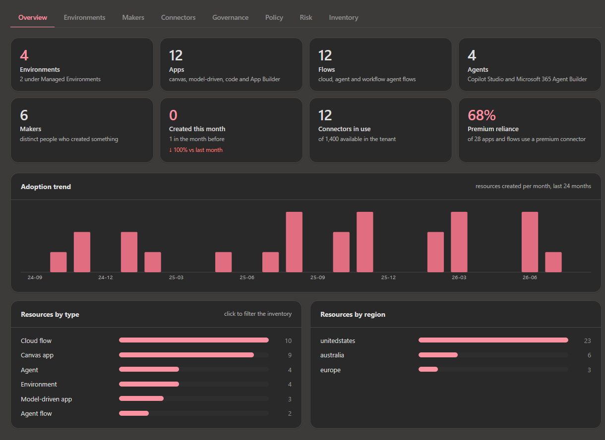
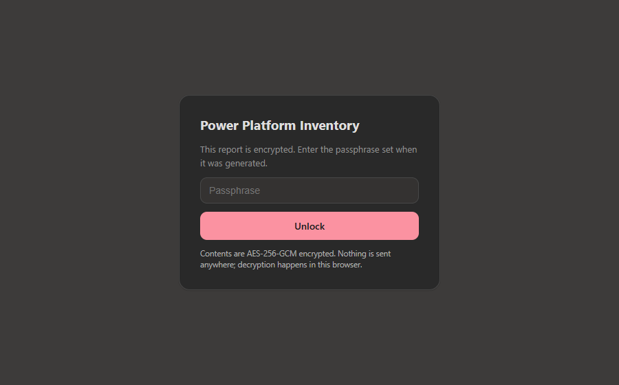
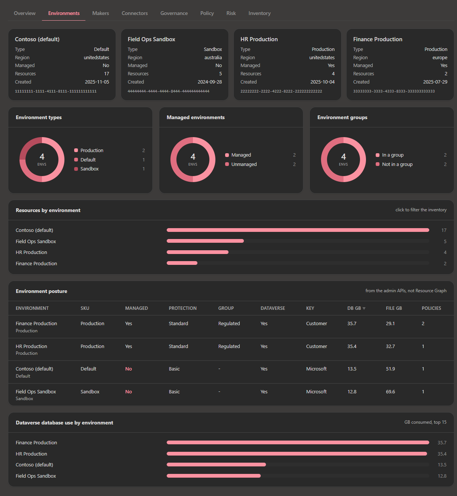
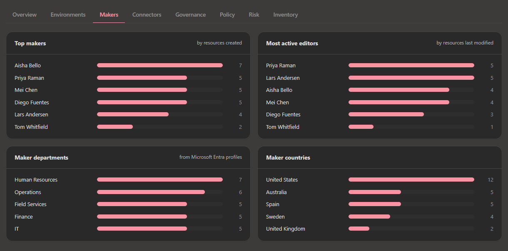
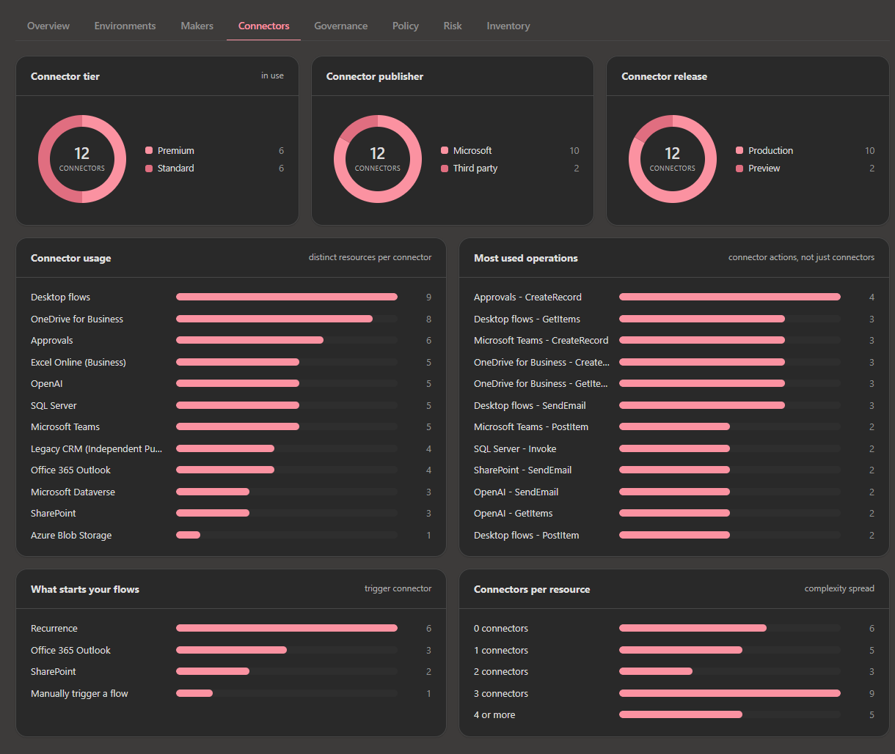
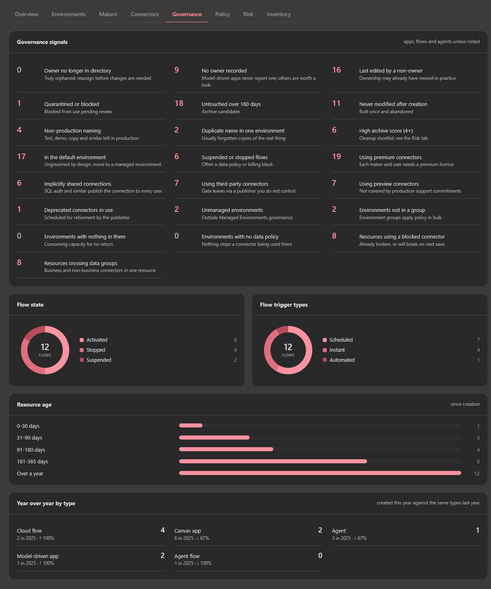
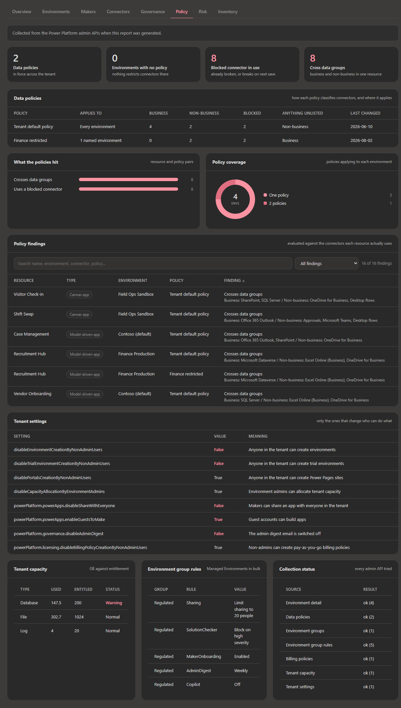
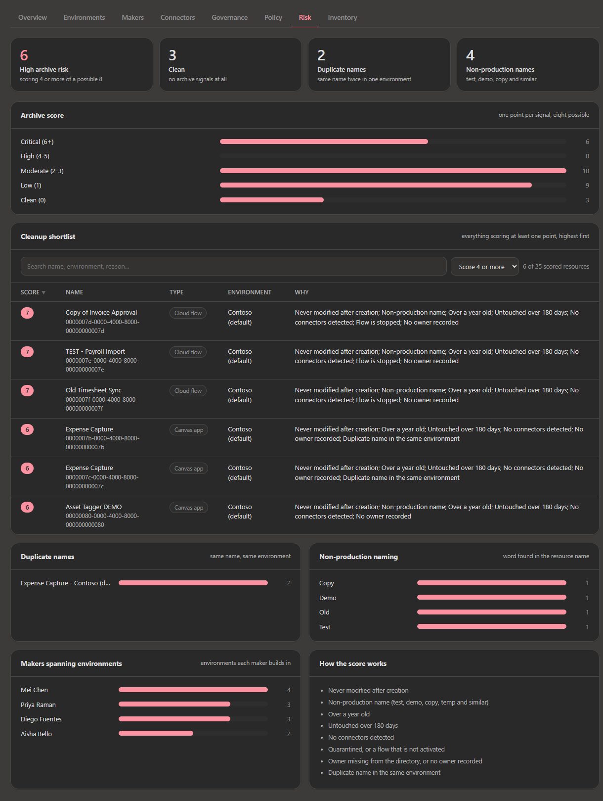
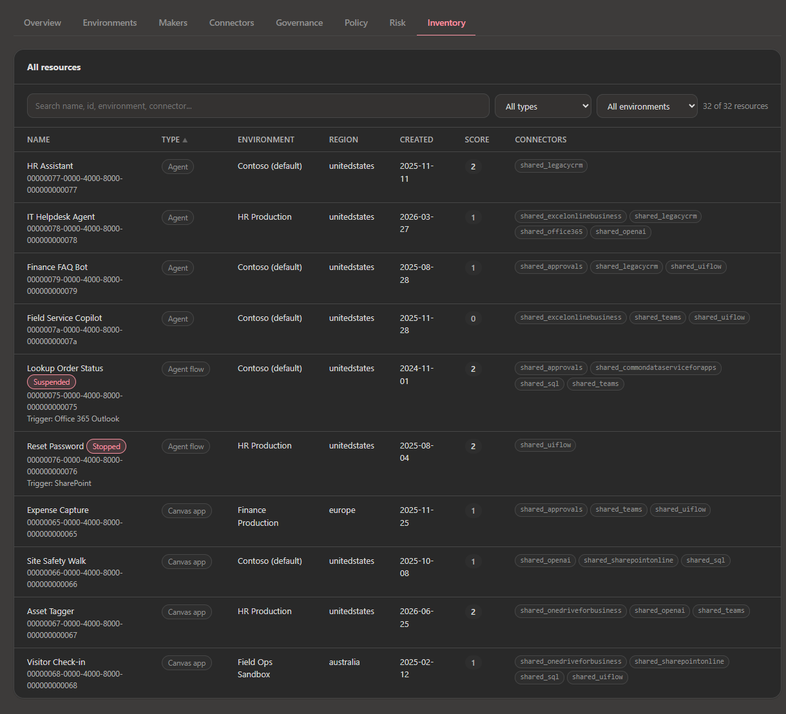
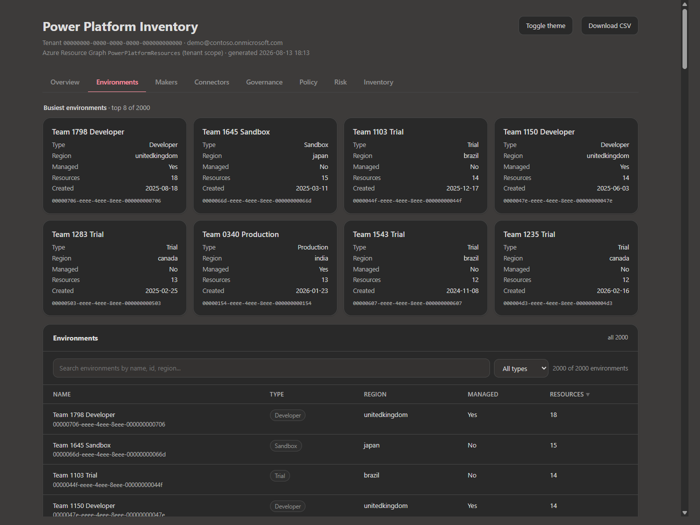

# Power Platform Inventory Dashboard

Generates a single self-contained HTML report of every environment, app, flow and agent
in a Power Platform tenant, using the `PowerPlatformResources` table in Azure Resource Graph.

No server, no build step, no dependencies in the output. One HTML file you can email.



## Why not just `az graph query`?

Because it doesn't work, and the error is misleading:

```
az graph query -q "PowerPlatformResources | take 1"
→ AccessDenied: Access is denied to the requested resource.
                The user might not have enough permission.
```

That error has nothing to do with permissions. `PowerPlatformResources` is a
**tenant-scoped** table, but `az graph query` always scopes to subscriptions and has no
tenant-scope flag. A tenant-scoped table queried at subscription scope returns
`AccessDenied` even when you are a Global Administrator.

You need tenant scope, which means either `Search-AzGraph -UseTenantScope` or the REST
API with both `subscriptions` and `managementGroups` omitted. This script uses the REST
API. See [Gotchas](#gotchas) for why.

## Prerequisites

- PowerShell 7+
- `Az.Accounts` (the only module needed)
- One of these **Microsoft Entra** roles: Global Administrator, Power Platform
  Administrator, Dynamics 365 Administrator, Global Reader, AI Administrator, or AI Reader

Power Platform RBAC roles do **not** grant access to inventory. It has to be an Entra role.

## Usage

```powershell
Install-Module Az.Accounts -Scope CurrentUser

Connect-AzAccount -Tenant <tenantId>      # add -UseDeviceAuthentication if MFA blocks the popup
.\export-inventory.ps1                    # prompts for a passphrase, writes dashboard.html
```

Then open `dashboard.html` in any browser and enter the passphrase.

Reports are **encrypted by default** because they carry tenant identifiers, resource names
and maker names. To produce an unprotected file you have to say so explicitly with
`-NoPassword`.

### Options

| Parameter | Default | Description |
| --- | --- | --- |
| `-OutFile <path>` | `dashboard.html` | Where to write the report |
| `-Deep` | off | Also read the Power Platform admin APIs: data policies, environment posture, capacity, tenant settings, environment group rules |
| `-Password <securestring>` | prompted | Passphrase used to encrypt the report. Weak ones are rejected |
| `-NoPassword` | off | Skip encryption. Writes tenant data in the clear |
| `-Ephemeral` | off | Write to a temp path, open it, then shred and delete |
| `-SensitivityLabel <guid>` | none | Apply a Purview label to the generated file |
| `-UploadTo <folder>` | none | Upload to OneDrive under this folder |
| `-ShareWithGroup <name>` | none | Grant that Entra group read on the uploaded file |
| `-Demo` | off | Render synthetic data. No sign-in, no tenant contacted, not encrypted |
| `-DemoEnvironments <n>` | `4` | Environment count for `-Demo`, for testing at scale |
| `-NoMakerNames` | off | Skip the Microsoft Graph lookup and show maker object IDs |

Preview it without a tenant:

```powershell
.\export-inventory.ps1 -Demo -OutFile demo.html
.\export-inventory.ps1 -Demo -Deep -OutFile demo.html   # includes the Policy tab
```

### Going beyond Resource Graph with `-Deep`

```powershell
.\export-inventory.ps1 -Deep
```

Resource Graph has no data policies, no capacity, no tenant settings and no environment
group rules. `-Deep` fills those in from the Power Platform admin APIs, which is what
powers the [Policy](#policy) tab and the environment posture table.

It reads these, and nothing else. Every call is a GET except tenant settings, which the
API only exposes as a POST. Nothing is written back:

| Source | Endpoint |
| --- | --- |
| Environment detail, capacity, protection level, encryption key | `api.powerplatform.com/environmentmanagement/environments`, falling back to `api.bap.microsoft.com/.../scopes/admin/environments` |
| Environment groups and their rules | `api.powerplatform.com/environmentmanagement/environmentGroups` |
| Billing policies | `api.powerplatform.com/licensing/billingPolicies` |
| Tenant capacity | `api.powerplatform.com/licensing/tenantCapacity` |
| Data policies | `api.bap.microsoft.com/providers/PowerPlatform.Governance/v1/policies` |
| Tenant settings | `api.bap.microsoft.com/.../listtenantsettings` |

Two of those need explaining.

**Data policies are still only on the older BAP endpoint, and it has to be `v1`.** There is
no DLP permission in the [Power Platform API permission reference](https://learn.microsoft.com/power-platform/admin/programmability-permission-reference)
yet, so nothing on `api.powerplatform.com` serves them. Of the two BAP versions, `v2`
returns the policy metadata but **omits `connectorGroups` entirely**, so a reader pointed at
it sees policies with no connector classification, silently drops every connector into the
default group, and reports zero findings on a tenant that actually has policies. `v1`
returns the groups. The field is also spelled `defaultConnectorsClassification`, with the
plural, on both versions.

**Environment detail has a fallback because the modern endpoint refuses.** Reading
`environmentmanagement/environments` needs the `EnvironmentManagement.Environments.Read`
delegated permission, and the Azure PowerShell client is not consented for it, so it
returns:

```
HTTP 403  InsufficientDelegatedPermissions
          Authorization denied: Application missing required delegated permissions
```

The older BAP endpoint accepts the same sign-in and returns more, including
`governanceConfiguration.protectionLevel`, so the script tries the documented endpoint
first and falls back. If you authenticate with your own app registration that *does* hold
that permission, the first endpoint answers and the fallback never runs.

Two further caveats:

- **Any source can be refused.** These audiences are separate from the Resource Graph one.
  Each source is probed independently, so a refusal costs you one panel, not the report.
  The **Collection status** table on the Policy tab lists exactly what answered and what
  did not.
- **API versions move.** Where two versions exist the script tries the newer one first and
  falls back, rather than pinning a version that will eventually be retired.

`-Deep` adds a handful of tenant-wide calls, not one per resource, so it costs seconds
rather than minutes even on a large tenant.

## Protecting the report

A generated report contains tenant IDs, environment GUIDs, resource names and maker
names. Treat it as confidential. The script supports four controls, listed strongest
first. They combine.

### 1. Do not keep it at all

The safest report is one that does not exist. Generation takes under a minute, so treat
it as disposable:

```powershell
.\export-inventory.ps1 -Ephemeral
```

Writes to a temporary path outside the repo and outside any synced folder, opens it, and
on Enter overwrites the bytes and deletes the file. Nothing lands in OneDrive, nothing
persists, nothing needs revoking later.

Overwrite-then-delete is best effort. On an SSD, wear levelling may retain the original
blocks, so treat this as "not casually recoverable" rather than forensically erased.

### 2. Apply a Purview sensitivity label

```powershell
.\export-inventory.ps1 -SensitivityLabel <labelGuid>
```

This is the strongest option for a file that has to persist, because the protection is
bound to identity: revocable, auditable, and it survives forwarding.

Two caveats. It needs the [Microsoft Purview Information Protection client](https://www.microsoft.com/download/details.aspx?id=53018)
(Windows only; the `PurviewInformationProtection` module is not on the PowerShell
Gallery), and HTML is not a natively labelable type, so Purview applies generic
protection and produces a `.pfile` wrapper. Recipients need the client to open it. If the
module is missing the script warns and carries on rather than silently skipping.

### 3. Store it where access is managed

```powershell
.\export-inventory.ps1 -UploadTo "Reports/PowerPlatform" -ShareWithGroup "Platform Admins"
```

Uploads to your OneDrive and grants **read to that Entra group only**, with sign-in
required and no invitation email. Access is revocable and audited, which a passphrase
never is.

This needs `Microsoft.Graph.Authentication` and a separate consent: the Azure token used
for the inventory query carries no `Files.ReadWrite` scope, so you will be prompted once.

### 4. Encrypt the file

Encryption is the default. Running the script prompts for a passphrase, asks you to
confirm it, and rejects weak ones outright. To pass one non-interactively:

```powershell
$pw = Read-Host "Report passphrase" -AsSecureString
.\export-inventory.ps1 -Password $pw
```

A weak `-Password` is rejected before the tenant is queried, so you find out immediately
rather than after a full run.

**Passphrase policy.** The file can be attacked offline by anyone who holds it, so length
is what matters. Following NIST SP 800-63B, composition rules are not imposed; a passphrase
is accepted if it is at least 12 characters, uses at least 5 distinct characters, is not a
keyboard or digit run, and either reaches roughly 60 bits of estimated entropy or is 20+
characters. Common words are blocked below 20 characters only, so `correct horse battery
staple` passes while `Password123!` does not. The prompt asks twice, because a typo would
make the report permanently unopenable.



This is real encryption, not a JavaScript gate. The dataset is encrypted with
**AES-256-GCM** using a key derived by **PBKDF2-HMAC-SHA256 over 600,000 iterations**
(the OWASP recommendation) with a random 16-byte salt and 12-byte IV. The HTML holds
ciphertext only, so viewing source or opening developer tools reveals nothing. Decryption
happens in the browser through the Web Crypto API; nothing is transmitted. A wrong
passphrase fails on the GCM authentication tag, which also means the file cannot be
tampered with undetected.

**Be honest about the threat model.** Anyone holding the file can attempt an offline
brute-force against the passphrase. 600,000 iterations makes that expensive but not
impossible, so the passphrase has to be long and random. A dictionary word will not hold.

### Where the data lives

Inside the `.html` file and nowhere else. The dataset is inlined at generation time as a
single `PAYLOAD` object. The report has no `src` or `href` to anything external, and
contains no `fetch`, `XMLHttpRequest`, `WebSocket` or `sendBeacon` call, so it never
reaches the network and works fully offline. Encrypting the report encrypts that payload,
so the data is protected at rest in the only place it exists.

After you unlock, the decrypted copy lives in browser memory for as long as the tab is
open. A **Lock** button discards it by reloading, and an encrypted report locks itself
automatically after 15 minutes idle.

### Exporting

**Download CSV** writes three files straight away, with a UTF-8 BOM so Excel reads them
correctly, plus two more when the report was generated with `-Deep`:

| File | Contents |
| --- | --- |
| `pp-resources.csv` | Every app, flow and agent with all fields, including owner, creator, last editor, quarantine state, trigger, archive score and connector operations |
| `pp-environments.csv` | Every environment with type, region, Managed Environments state, group and resource count |
| `pp-summary.csv` | Every number the report displays: counts, growth, all distributions, the governance signals, tenant settings and collection status |
| `pp-environment-posture.csv` | `-Deep` only. SKU, group, Dataverse, encryption key, capacity and applicable policies per environment |
| `pp-policy-findings.csv` | `-Deep` only. Every resource and policy pair that uses a blocked connector or crosses data groups |

The resource file covers every row matching the current filters, not just the visible
page, so a filtered view exports a filtered file. The summary always describes the whole
tenant.

These files are **not encrypted**, so exporting from an encrypted report moves the data
outside its protection. The report asks for confirmation once before doing that. Values
starting with `=`, `+`, `-` or `@` are prefixed with a quote so Excel treats them as text
rather than formulas.

### Choosing between them

A passphrase cannot be revoked, does not expire, and leaves no audit trail. A sensitivity
label and Entra group access do all three, so prefer those whenever the file stays inside
your tenant. Use `-Password` for reports that must travel outside it, and `-Ephemeral`
whenever you only need to look at something once.

Be aware that a folder under `OneDrive` syncs to the cloud, which is fine for an encrypted
report and an exfiltration path for a `-NoPassword` one.

## What's in the report

The layout follows the reporting the [CoE Starter Kit Power BI dashboard](https://learn.microsoft.com/power-platform/guidance/coe/power-bi) used to provide,
rebuilt on the inventory data the admin center now exposes. Content is split across eight
tabs so no single page runs long. Tabs are keyboard navigable with the arrow keys, and
printing expands every tab so a PDF contains the whole report.

Every screenshot below is the `-Demo` output. The names, GUIDs and numbers are invented.

### Overview

Environments, apps, flows, agents and makers, each with a subtitle saying what it counts,
plus resources created this month against last month and how much of the estate depends on
premium connectors. Underneath, the CoE creation-trend visual over 24 months, and breakdown
by type and region.


### Environments

Tiles for the busiest environments, a searchable table of all of them with resource counts,
and coverage of environment types, Managed Environments and environment groups. With
`-Deep`, an **environment posture** table is added with SKU, Managed Environments
protection level, environment group, whether Dataverse is provisioned, who holds the
encryption key, Dataverse database and file consumption, and how many data policies apply.



### Makers

Top makers and most active editors, which are not the same people, plus department and
country pulled from Microsoft Entra profiles. Object IDs are resolved to real names.



### Connectors

Tier, publisher and release stage for every connector in use, then usage by connector, by
*operation* rather than just connector, what actually triggers your flows, and how many
connectors each resource pulls in.

Only built-in triggers such as *Manually trigger a flow* report a display name. Connector
triggers report an id, so those are resolved against the connector catalogue rather than
listed as unknown.



### Governance

Nineteen tenant-hygiene checks: owners who no longer resolve in the directory (true
orphans), no owner recorded, last edited by a non-owner, quarantined apps, untouched over
180 days, never modified after creation, non-production naming, duplicate names inside one
environment, a high archive score, sitting in the default environment, suspended flows,
premium connector reliance, implicitly shared connections such as SQL auth, third-party
connectors, preview connectors, deprecated connectors, unmanaged environments,
environments outside a group, and empty environments. Plus flow state, trigger types,
resource age and year-over-year growth broken down by resource type.



### Policy

Only populated when you pass `-Deep`. Everything here comes from the Power Platform admin
APIs rather than Resource Graph.

The useful part is **policy findings**. Each data policy's connector classification is
evaluated against the connectors every app, flow and agent actually uses, so you get the
two things a policy can do to a resource:

- **Uses a blocked connector** - already broken, or breaks the next time someone saves it
- **Crosses data groups** - business and non-business connectors in the same resource,
  which the policy will not allow

Connectors a policy does not name fall into that policy's default classification, so an
unlisted connector is not treated as safe. Findings are per resource and policy pair,
because one resource can breach two policies for different reasons.

Also on this tab: what each policy classifies and where it applies, how many policies cover
each environment, tenant settings that change who is allowed to do what, tenant capacity
against entitlement, and environment group rules.



**Collection status.** Every admin API call is listed with its result. Anything that could
not be read says so, with the HTTP status or error, and the affected panel says "not
collected" rather than showing a zero. A missing endpoint never fails the run, and a zero
in this report always means zero.

That distinction matters most for data policies. "Could not read the policies" and "read
them fine, there are none" look identical if you only count rows, and the second is the
more alarming of the two. A tenant with no policy at all gets told so in as many words.

### Risk

An **archive score** for every app, flow and agent, rebuilt from the CoE idea. One point
for each of eight signals, so the number is auditable rather than a black box, and every
row spells out which signals it tripped:

| Signal | Why it counts |
| --- | --- |
| Never modified after creation | Built once and abandoned |
| Non-production name | test, demo, copy, temp, draft, backup and similar |
| Over a year old | Age alone is weak, but it compounds |
| Untouched over 180 days | The usual archive threshold |
| No connectors detected | An empty shell, on the types that report connectors |
| Quarantined, or a flow that is not activated | Already blocked or switched off |
| Owner missing from the directory, or none recorded | Nobody to ask before deleting |
| Duplicate name in the same environment | Usually a forgotten copy |

The cleanup shortlist defaults to a score of 4 or more and is searchable, sortable and
paginated. Alongside it: duplicate names, which non-production words are actually in use,
and makers building across multiple environments.

Environments and environment groups are containers rather than things a maker builds, so
they are never scored and never counted in the ownership, staleness or connector signals.

The score is exported in `pp-resources.csv` as `archiveScore` and `archiveWhy`, so you can
hand a filtered list straight to an owner.



### Inventory

Every resource, searchable, sortable and paginated, with its archive score and connectors
shown per row, and CSV export.



### Beyond the CoE kit

Things the inventory data supports that the CoE dashboard never showed: connector
*operations* rather than just connectors, what actually triggers your flows, resource age
distribution, connectors-per-resource complexity spread, most active editors as distinct
from creators, environment group coverage, connector release stage, duplicate names inside
an environment, and makers building across multiple environments.

Clicking a bar in **Resources by type** or **Resources by environment** cross-filters the
resource table, the way a Power BI page filters on selection. A **Clear filters** button
appears on both tables whenever a filter is active, including one set by a chart click.

Both tables paginate with first/prev/next/last and a 25/50/100/250 page-size selector.
The pager hides itself when everything fits on one page. CSV export always covers every
matching row, not just the visible page; see [Exporting](#exporting).

## Coverage compared with the CoE Starter Kit

The CoE kit drew on several sources. This report has only the inventory table, so some of
its pages can be reproduced and some cannot.

**Reproduced:** environment counts, types, managed count and creation trend; resources per
environment; app, flow and agent counts; canvas vs model-driven split; flow state and
trigger breakdowns; top connectors; connector tier for licence planning; makers and top
makers; maker department and country; year-over-year and month-over-month growth, per type
as well as overall; orphaned, quarantined, stale and suspended resources; and an archive
score for cleanup triage.

**Not possible from inventory data**, because it came from the audit log or other APIs the
CoE kit collected separately:

| CoE feature | Needs |
| --- | --- |
| App launches, last launched, monthly active users | Audit log |
| Shared with (users, groups, whole tenant) | Power Apps sharing API |
| Desktop flows / RPA, AI Builder models, Power Pages, solutions, connection references | Not resource types in the inventory schema |

`-Deep` closes several of these: the CoE **DLP Impact Analysis** app, **Environment
Capacity** page and tenant-hygiene policy checks are all rebuilt from the admin APIs.

The archive score here is the CoE idea rebuilt without usage telemetry. CoE weighted
*last launched* heavily; this scores staleness from *last modified* instead, so treat a
high score as a shortlist to review rather than proof that nobody uses the thing.

If you need those, the admin center **Usage** page covers engagement and adoption, and
**Monitor** covers operational health.

### Maker names

Azure Resource Graph stores only object IDs for creators and owners. The script resolves
them through `directoryObjects/getByIds` on Microsoft Graph, using the token you already
signed in with, and requests `department`, `city`, `country` and `accountEnabled` with
`$select`. IDs that come back unresolved are treated as departed accounts, which is how
true orphans are detected.

If the call fails the report falls back to object IDs, skips the orphan check rather than
reporting a wrong number, and carries on. Pass `-NoMakerNames` to skip the lookup.

### Connector tier

The inventory schema notes that tier and publisher aren't exposed on the connector *usage*
array, which is true. They are exposed on the connector *catalog* records, so the script
reads the catalog and joins on connector ID. That is what makes the Premium/Standard split
and the deprecated-connector check possible.

## Files

| File | Purpose |
| --- | --- |
| `export-inventory.ps1` | Queries ARG and renders the report |
| `dashboard.template.html` | Markup, styles and client script, with a `__PPDATA__` placeholder |
| `demo-data.ps1` | Synthetic dataset for `-Demo` |

Keep all three in the same folder.

## Gotchas

Things that cost real debugging time, recorded so you don't repeat them.

**`Search-AzGraph` can silently return one row of nulls.** Instead of raising an error it
occasionally hands back a single all-null record. This looks exactly like an empty tenant.
Six backoff retries in a row failed while identical direct calls in the same session
succeeded, so it is not simple throttling. The script uses `Invoke-AzRestMethod` against
the ARG REST endpoint and checks `StatusCode` explicitly.

**ARG caps every response at 1000 records.** Without `$skipToken` paging a large tenant
truncates silently and the report quietly under-reports. The script pages until the token
is exhausted and warns if the returned count is below `totalRecords`.

**Inline JSON in `az rest --body` breaks on Windows PowerShell.** You get
`RequestDeserializationFailure`. Write the body to a file and use `--body "@file.json"`.

**A `| count` column collides with PowerShell's own `.Count`.** Alias it:
`| summarize catalogCount = count()`.

**`ConvertTo-Json` unwraps single-element arrays into bare objects.** A tenant using exactly
one connector produced `connectorTier` as an object, not an array, and every `.filter` call
on it threw. The client script normalises each list before use.

**Model-driven apps never report an owner.** Treating an empty `ownerId` as orphaned makes
every model-driven app a false positive. The orphan check only considers resources that
name an owner who no longer resolves in the directory.

**A class-level `display` rule beats the browser's `[hidden]` rule.** `.lock { display: flex }`
kept the passphrase screen visible even with the `hidden` attribute set, briefly showing
both the lock and the report. Fixed with a global `[hidden] { display: none !important }`,
which matters anywhere `hidden` is used on a grid or flex container.

**The HTML parser beats JSON escaping.** The dataset is embedded in an inline `<script>`,
so a resource named `</script>` closed the tag early and let the rest of the payload be
parsed as markup, injecting elements into the page. Resource names are maker-controlled,
so this was a stored XSS route. `<`, `>` and `&` are now emitted as JSON unicode escapes,
which `JSON.parse` restores unchanged.

**Excel evaluates formulas in CSV even inside quotes.** A resource named `=cmd|'/c calc'!A1`
would run on open. Exported values starting with `= + - @` are prefixed with a quote.

**An overlay does not trap focus on its own.** Tab walked straight out of a modal dialog
into the page behind it, so a keyboard user could operate controls they could not see. The
passphrase dialog carries `role="dialog"`, `aria-modal`, a label and a Tab cycle.

**Conditional Access on Azure Resource Manager blocks inventory.** If MFA is required for
ARM, include the Power Platform admin center client ID
`00b46ad5-e4ae-43ac-a878-281fc03d0839` and the Microsoft Azure Management resource in
the policy.

**Not available in sovereign clouds.** GCC, GCC-High, DoD, 21Vianet and air-gapped
environments do not have Power Platform inventory.

## Scale

Measured with `-Demo -DemoEnvironments 2000` (2000 environments, 13,000 resources):

| | Naive render | Paginated |
| --- | --- | --- |
| DOM nodes | 209,701 | 6,594 |
| Environment section height | 102,363 px | 8,153 px |
| Full page height | 1,364,072 px | 8,596 px |
| Sort click | 237 ms | ~59 ms |



Environment tiles always lead the page. Up to 12 environments every one gets a tile; past
that the busiest 8 are tiled and the full set moves into a searchable paginated table
directly below. Both tables render one page at a time, charts show the top 10 with an
expand toggle, and per-environment counts are computed during generation rather than in
the browser.

The remaining constraint is file size: 13,000 resources produces roughly 12.6 MB of HTML,
or 13.3 MB with `-Deep`, because the dataset is inlined. That is the tradeoff for a
genuinely self-contained file. Beyond about 50,000 resources the data should move to an
external JSON file.

## Privacy

Generated reports embed tenant ID, the signed-in admin UPN, environment GUIDs, resource
names and maker display names. `.gitignore` excludes `dashboard.html` for this reason.
Share the scripts, let people generate their own report. Use `-NoMakerNames` if you need
to circulate a report without naming individuals, and `-Password` or a sensitivity label
if the file has to leave your control. See [Protecting the report](#protecting-the-report).

## Licence

MIT
